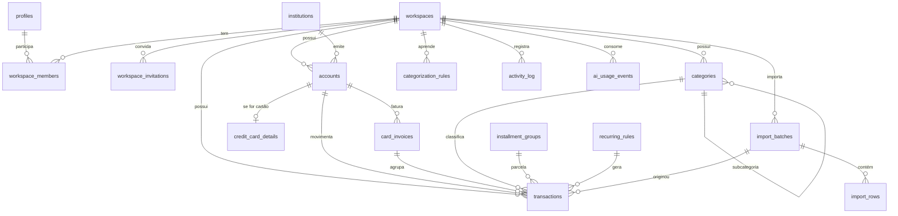

# Domínio

Entidades, relações e regras de negócio do Naency. Nomes de tabela e coluna em
inglês (como ficam no banco); explicações em pt-BR. Convenções gerais (centavos,
datas, soft delete, autoria) estão em [arquitetura](./architecture.md#convenções-de-dados).

## Glossário

| Termo na interface | Entidade | Significado |
| --- | --- | --- |
| Espaço | `workspaces` | Conjunto de finanças compartilhado (ex.: "Finanças da casa") |
| Membro | `workspace_members` | Pessoa com acesso a um espaço, com um papel |
| Instituição / banco | `institutions` | Nubank, XP, Itaú… |
| Conta | `accounts` | Conta corrente, poupança, investimento, dinheiro ou cartão de crédito |
| Lançamento / transação | `transactions` | Receita, despesa ou transferência |
| Fatura | `card_invoices` | Período de cobrança de um cartão |
| Parcelado | `installment_groups` | Compra dividida em N parcelas |
| Recorrente | `recurring_rules` | Lançamento que se repete (aluguel, salário) |
| Importação | `import_batches` | Um arquivo de extrato enviado e processado |

## Diagrama

## Identidade e compartilhamento

Os dados financeiros **pertencem ao espaço, não à pessoa**. Duas pessoas no mesmo
espaço veem os mesmos dados, cada uma logada na própria conta.

- **`profiles`**: `id` (igual ao usuário do Supabase Auth), `name`, `avatar_url`.
- **`workspaces`**: `name`, `currency` (padrão `BRL`), `onboarding_step`
  (onboarding retomável), `created_by`.
- **`workspace_members`**: `workspace_id`, `user_id`, `role`, `joined_at`.
  Chave única (`workspace_id`, `user_id`).
- **`workspace_invitations`**: `workspace_id`, `email`, `role`, `token_hash`,
  `expires_at`, `accepted_at`, `invited_by`.

### Papéis

| Ação | `admin` | `editor` | `viewer` (leitor) |
| --- | :-: | :-: | :-: |
| Ver todos os dados do espaço | ✓ | ✓ | ✓ |
| Criar, editar e excluir lançamentos, contas, categorias | ✓ | ✓ | — |
| Importar extratos | ✓ | ✓ | — |
| Convidar, remover e mudar papel de membros | ✓ | — | — |
| Renomear ou excluir o espaço | ✓ | — | — |

Regras:

- Um espaço tem sempre pelo menos um `admin`; o último admin não pode sair nem ser rebaixado.
- Um usuário pode estar em vários espaços.
- Convite é um **link** (`/convite/<token>`) gerado em `/membros` e enviado por quem
  convida (WhatsApp, e-mail pessoal). Expira em 7 dias e é de uso único; o banco guarda
  só o hash SHA-256 do token.
- Só aceita quem entrar com **o e-mail convidado**: um link vazado não serve para outra
  pessoa. Quem entra com outro e-mail vê só o e-mail convidado mascarado (`a***@dominio`).
- Convidar de novo o mesmo e-mail substitui o convite pendente anterior. Não dá para
  convidar quem já é membro, nem convidar como `admin` (por enquanto).
- O aceite marca o convite como usado só se ele ainda não foi (duas abas ao mesmo tempo
  não criam dois aceites). Regras em `server/invitations/evaluate.ts`, com testes.
- Quem entra por convite **pula o onboarding**, porque o espaço já está configurado.
- A regra é aplicada no DAL (`requireMembership`) e coberta por testes de integração por papel ([testes](./testing.md)).

### Gerenciar membros

- Só admin troca papéis e remove pessoas; qualquer membro pode sair do espaço.
- O espaço nunca fica sem administrador: rebaixar ou remover o último admin é
  recusado, e a verificação roda dentro da mesma transação da alteração.
- Lançamentos feitos por quem saiu continuam no espaço.

## Instituições

- **`institutions`**: `slug` (identificador estável do catálogo), `name`, `compe_code`, `kind` (`bank | broker | wallet`),
  `color`, `logo`, `import_formats` (ex.: `['csv','ofx','pdf']`),
  `export_instructions` (passo a passo para exportar o extrato naquele banco),
  `workspace_id` (nulo no catálogo global; preenchido quando o espaço cadastra uma instituição própria).
- Catálogo semeado (migration `0002_seed_institutions.sql`): Nubank, XP, Itaú, Inter,
  C6, Banco do Brasil, Caixa, Bradesco, Santander e "Dinheiro/Carteira". Formatos de
  importação e instruções de exportação são preenchidos na Fase 3, com extratos reais.
- A interface mostra iniciais sobre a cor da instituição, sem logos de terceiros.
- Uma conta só pode apontar para instituição do catálogo ou do próprio espaço (checado no DAL).

## Contas

- **`accounts`**: `workspace_id`, `institution_id`, `name`, `type`
  (`checking | savings | investment | cash | credit_card`), `currency`,
  `initial_balance_cents`, `initial_balance_date`, `color`, `archived_at`.
- **Saldo não é armazenado.** Saldo = `initial_balance_cents` + soma de
  `amount_cents` dos lançamentos efetivados a partir de `initial_balance_date`.
- Tipos criáveis hoje: corrente, poupança, investimentos e dinheiro. Cartão de crédito
  entra na Fase 2, com fechamento, vencimento e faturas.
- Leitor vê as contas; editor e admin criam, editam e arquivam. Não há exclusão:
  arquivar preserva o histórico.
- Conta arquivada some das listas, mas seus lançamentos continuam no histórico e nos relatórios.

## Cartão de crédito

Cartão é uma conta do tipo `credit_card` com detalhes e faturas.

- **`credit_card_details`**: `account_id` (PK), `closing_day`, `due_day`,
  `limit_cents`, `default_payment_account_id`.
- **`card_invoices`**: `account_id`, `reference_month` (mês do **vencimento**, ex.: 2026-10),
  `closing_date`, `due_date`, `paid_at`, `payment_transfer_group_id`. O status é
  derivado (`lib/cards.ts`): paga se tem `paid_at`; senão aberta até o fechamento e
  fechada depois.

Regras (`lib/cards.ts`, com testes):

- **Qual fatura recebe a compra**: compra até o dia de fechamento (inclusive) entra
  na fatura que fecha naquele mês; depois, na do mês seguinte. O vencimento cai no
  mês do fechamento se o dia de vencimento for maior que o de fechamento; senão, no
  mês seguinte. Dias além do fim do mês usam o último dia (fechamento 31 em fevereiro).
- A fatura é criada sob demanda quando o primeiro lançamento cai nela. Mudar a data
  ou a conta de uma compra recalcula a fatura.
- **Total da fatura** = soma dos lançamentos ligados a ela, sem transferências.
- **Pagar fatura** cria uma transferência da conta de pagamento para o cartão e
  marca `paid_at`; desfazer exclui a transferência e reabre.
- **Limite disponível** = limite − dívida do cartão (todas as compras, inclusive
  parcelas futuras).
- **Parcelado** (`installment_groups`): o valor digitado é o total; gera uma despesa
  por mês (mesmo dia, limitado ao fim do mês), cada uma na sua fatura, com
  "Descrição (k/N)". A sobra dos centavos vai na primeira. Editar muda só a parcela;
  excluir remove a compra inteira. Parcelar só em despesa de cartão.
- Uma conta não vira cartão nem deixa de ser cartão depois de criada.

## Lançamentos

- **`transactions`**: `workspace_id`, `account_id`, `kind`
  (`income | expense | transfer`), `amount_cents` (com sinal), `date`,
  `description` (limpa, exibida), `raw_description` (como veio do banco),
  `category_id`, `status` (`planned | cleared`), `payment_method`
  (`pix | boleto | debit_card | credit_card | cash | bank_transfer`, opcional),
  `paid_at` (dia do pagamento/recebimento), `invoice_id`,
  `transfer_group_id`, `installment_group_id`, `installment_number`,
  `installment_total`, `recurring_rule_id`, `import_batch_id`, `fingerprint`,
  `notes`, `created_by`, `updated_by`, `deleted_at`.

Regras:

- **Situação** (exibida, nunca gravada): `cleared` = paga/recebida; `planned` com
  `date` anterior a hoje (America/Sao_Paulo) = **atrasada**; senão, a pagar/a receber.
  O filtro "Atrasadas" ignora o período: mostra tudo que venceu e não foi pago.
- **`paid_at`** só existe em efetivados (check `transactions_paid_at_cleared`).
  Vazio no formulário usa a data do lançamento; "marcar como paga" grava hoje;
  voltar para previsto limpa. Importados entram com a data do extrato.
- **`payment_method`**: escolhido no formulário. Lançamento em conta cartão (e
  parcelas) assume `credit_card`; na importação, `inferPaymentMethod` lê Pix,
  boleto, TED/DOC, saque e débito na descrição.
- **Sinal**: `income` > 0, `expense` < 0. Em `transfer`, a perna de saída é negativa e a de entrada, positiva.
- **Transferência** = dois lançamentos com o mesmo `transfer_group_id`, um em cada
  conta, com valores opostos e sem categoria. Editar ou excluir uma perna afeta as duas.
- **Transferência não conta como receita nem como despesa** nos relatórios.
- **Parcelado** (`installment_groups`: `description`, `total_amount_cents`,
  `installments_count`, `first_date`): gera N lançamentos, um em cada fatura futura.
  A diferença de arredondamento de centavos vai na primeira parcela.
- **Recorrente** (`recurring_rules`: `account_id`, `kind`, `amount_cents` positivo,
  `description`, `category_id`, `frequency` `monthly | weekly | yearly`,
  `start_date`, `end_date`, `generate_from`, `active`): gera lançamentos `planned`
  até 45 dias à frente, a cada carregamento do app (idempotente pela chave
  `recurring_rule_id + recurrence_date`). A primeira data define o dia; mensal e anual
  limitam ao fim do mês. Ocorrências anteriores à criação da regra não são geradas.
  Excluir uma ocorrência não faz ela voltar. Editar ou pausar a regra refaz só os
  previstos futuros; os efetivados ficam. Confirmar o pagamento os torna `cleared`.
- **`planned`** não entra no saldo atual; entra na projeção.
- **Listagem**: sem filtro de conta, a transferência aparece uma vez (pela perna de
  saída); filtrando por conta, aparece a perna daquela conta.
- **Trocar o tipo** entre transferência e receita/despesa substitui as linhas numa
  transação só (as antigas ficam com `deleted_at`).
- Conta ou categoria arquivada não recebe lançamento novo, mas o lançamento que já
  a usa continua editável.
- **`fingerprint`** = hash de (conta, data, valor, descrição normalizada, ordem da
  ocorrência no dia). Serve para deduplicar importações.

## Categorias

- **`categories`**: `workspace_id`, `parent_id`, `name`, `kind` (`income | expense`),
  `icon`, `color`, `archived_at`.
- Criar o espaço semeia o conjunto padrão em pt-BR (`lib/categories.ts`,
  `DEFAULT_CATEGORIES`), que junta as categorias do Naency antigo sem duplicatas
  (ex.: "Luz" = Energia, "Táxi/Uber" = Aplicativos, streaming em Assinaturas).
  As migrations `0004`, `0010` e `0011` completam os espaços que já existiam, sem apagar nem
  sobrescrever o que a pessoa criou.
- Nome único por espaço, tipo e nível, sem diferenciar maiúsculas.
- O tipo (receita/despesa) não muda depois de criada. A principal só vira
  subcategoria se não tiver subcategorias; o pai precisa ser do mesmo tipo.
- Arquivar a principal arquiva as subcategorias; desarquivar uma subcategoria traz o pai.
- `icon` é um nome de `CATEGORY_ICONS` e `color` uma cor da paleta (hex).
- Profundidade máxima de 2 níveis (categoria → subcategoria).
- Categoria arquivada não aparece para novos lançamentos, mas continua nos antigos.

## Planejamento

- **`budgets`**: orçamento mensal (`amount_cents`) por categoria **principal** de
  despesa; o gasto soma as subcategorias e considera só efetivados.
- **`goals`**: `name`, `target_cents`, `target_date` opcional e `account_id` (conta
  que não é cartão). O guardado é o saldo da conta; com data, mostra quanto guardar
  por mês (arredondado para cima).

## Memória de categorização

- **`categorization_rules`**: `workspace_id`, `match_type` (`contains | exact`),
  `pattern` (sobre a descrição normalizada), `category_id`, `rename_to`,
  `source` (`user | ai`), `hits`, `last_used_at`.
- É aplicada **antes** de chamar a AI. Uma regra do usuário vence uma regra da AI.
- Quando o usuário corrige uma categoria na revisão da importação, ele pode marcar
  "lembrar para os próximos", o que cria ou atualiza uma regra `user`.

## Importação

Detalhes do fluxo em [importação e onboarding](./import-and-onboarding.md).

- **`import_batches`**: `workspace_id`, `account_id`, `institution_id`,
  `file_path`, `file_format` (`pdf | csv | ofx`), `document_kind`
  (`statement | card_invoice`), `period_start`, `period_end`, `status`
  (`uploaded → processing → review → completed | failed`), `error`,
  `ai_model`, `ai_cost_cents`, `created_by`.
- **`import_rows`**: `batch_id`, `parsed` (data, valor, descrição original),
  `suggestion` (descrição limpa, categoria, tipo, parcela, possível transferência),
  `confidence`, `duplicate_of_transaction_id`, `decision` (`pending | accept | skip`),
  `edited` (valores alterados na revisão).

## Atividade e custos

- **`activity_log`**: `workspace_id`, `actor_id`, `action`, `entity_type`,
  `entity_id`, `summary`, `created_at`. Mostra aos membros o que mudou
  (ex.: "Danilo importou a fatura Nubank de setembro").
- **`ai_usage_events`**: `workspace_id`, `task` (`extract | enrich | …`), `model`,
  `input_tokens`, `output_tokens`, `cost_cents`, `import_batch_id`, `created_at`.
  Alimenta a tela de consumo de AI em Configurações.

## Futuro (ainda sem modelo)

Orçamentos por categoria e metas de economia, no menu "Planejamento".
